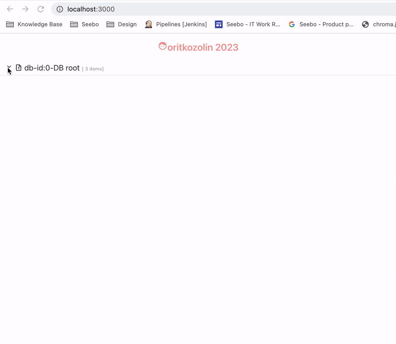
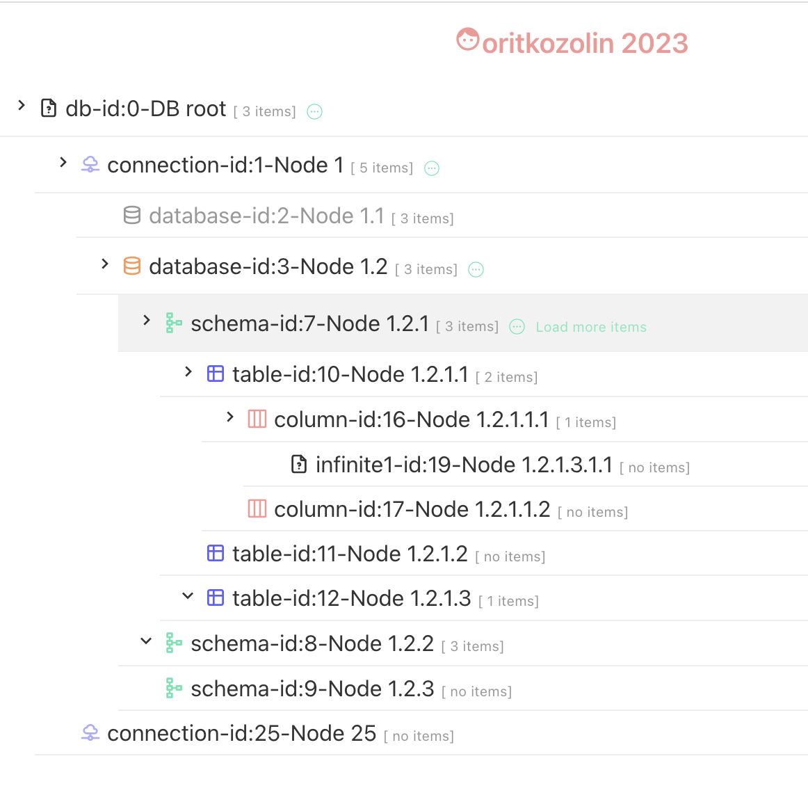

# Database Navigator Tree
react.typescript.styled-components

## Specifications
- The structure of the DB integration is:

  Connection > Database > Schema > Table > Column.
- A user needs permission in order to expand an item.
  If he doesn’t have permission - he can only view the item, but not it’s content. (This is relevant to any level of the tree)

## Main implementation features
1. Support for infinite depth by implementing recursive tree
2. Lazy loading support a large quantity of items by fetching data selectively upon clicking node with permission on the load more icon.
3. Nested tree component that can handle large trees using lazy loading, pagination, and limited item counts per level.
4. Configurable icons for the nested levels in  `utils/iconsMap.ts` file
5. Configurable labels for the nested levels in `constants/general.ts` file

### API
Flexible api pattern to adapt to the dynamic tree level:
`${baseUrl}/${type}s/${id}?path=${queryParams.path}&page=${queryParams.page}&pageSize=${queryParams.pageSize}`
- baseUrl = /api
- type = db,connection,database,schema,table,column....
- id = item id
- path - nested path
- page - page number
- page_size = number of items per page

### UI highlights
1. Colorful icons for each category
2. Highlight expandable row on hover
3. Change cursor when node is the last one or has no permission
4. Grey out nodes with no permission
5. Display of number of available children per node
6. 'Load more' icon for lazy loading for each item that can
7. be expanded. When all the items are loaded , the icon is not displayed any more

### Mocking
Mocking response data from server with `axios-mock-adapter`

##
##

This project was bootstrapped with [Create React App](https://github.com/facebook/create-react-app).

## Available Scripts

In the project directory, you can run:

### `npm start`

Runs the app in the development mode.\
Open [http://localhost:3000](http://localhost:3000) to view it in the browser.

The page will reload if you make edits.\
You will also see any lint errors in the console.

### `npm test`

Launches the test runner in the interactive watch mode.\
See the section about [running tests](https://facebook.github.io/create-react-app/docs/running-tests) for more information.

### `npm run build`

Builds the app for production to the `build` folder.\
It correctly bundles React in production mode and optimizes the build for the best performance.

The build is minified and the filenames include the hashes.\
Your app is ready to be deployed!

See the section about [deployment](https://facebook.github.io/create-react-app/docs/deployment) for more information.

### `npm run eject`

**Note: this is a one-way operation. Once you `eject`, you can’t go back!**

If you aren’t satisfied with the build tool and configuration choices, you can `eject` at any time. This command will remove the single build dependency from your project.

Instead, it will copy all the configuration files and the transitive dependencies (webpack, Babel, ESLint, etc) right into your project so you have full control over them. All of the commands except `eject` will still work, but they will point to the copied scripts so you can tweak them. At this point you’re on your own.

You don’t have to ever use `eject`. The curated feature set is suitable for small and middle deployments, and you shouldn’t feel obligated to use this feature. However we understand that this tool wouldn’t be useful if you couldn’t customize it when you are ready for it.

## Learn More

You can learn more in the [Create React App documentation](https://facebook.github.io/create-react-app/docs/getting-started).

To learn React, check out the [React documentation](https://reactjs.org/).
